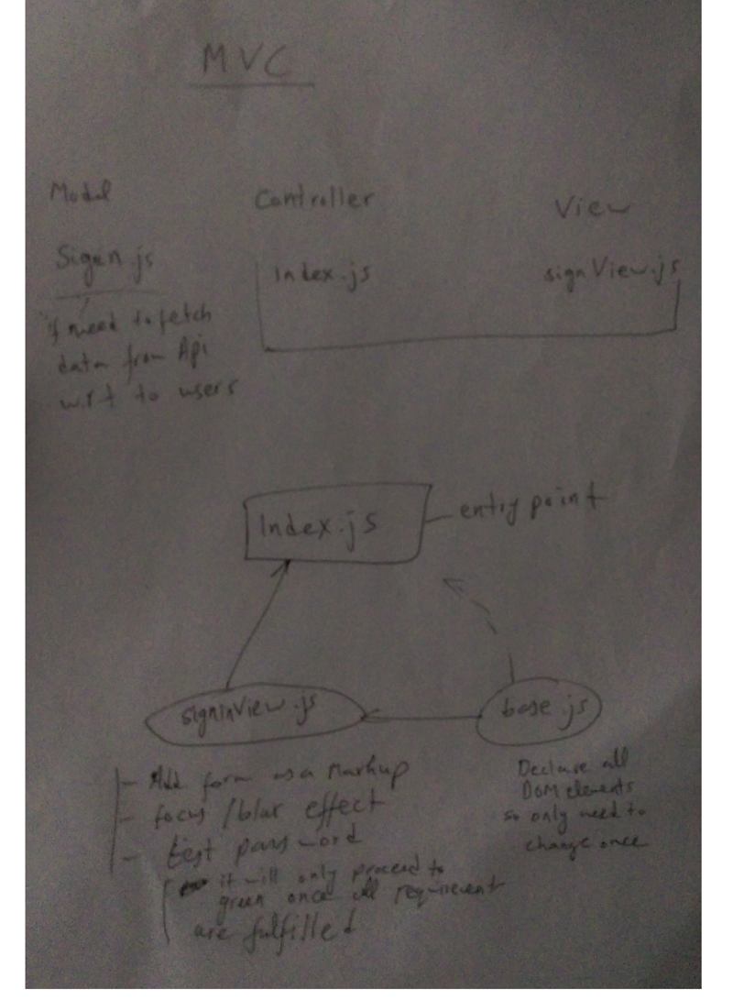
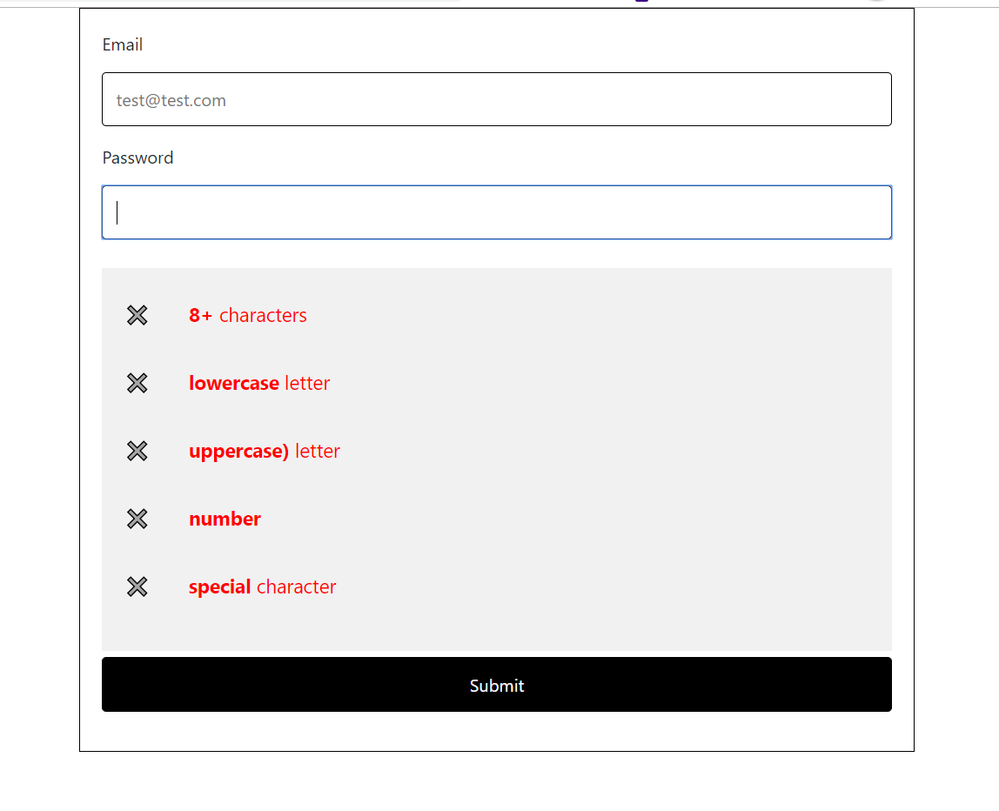
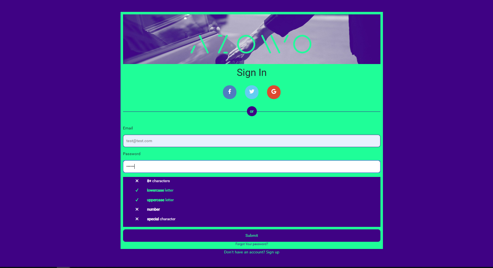

# SignCard-Task
Designed and implemented a sign in card 
Used: HTML5/CSS3, javaScript (ESnext), webpack, babel, npm, git , Adobe XD, Photoshop

Demos
Main Task : https://m90khan.github.io/SignCard-Task/dist/index.html
Task1 (required): https://m90khan.github.io/SignCard-Task/task1/index.html
Task2 (plain js): https://m90khan.github.io/SignCard-Task/task2/index.html

Scroll to see the screenshots below ...

